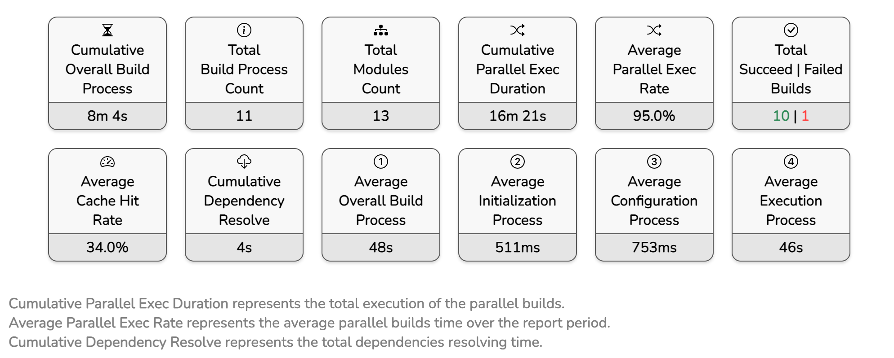
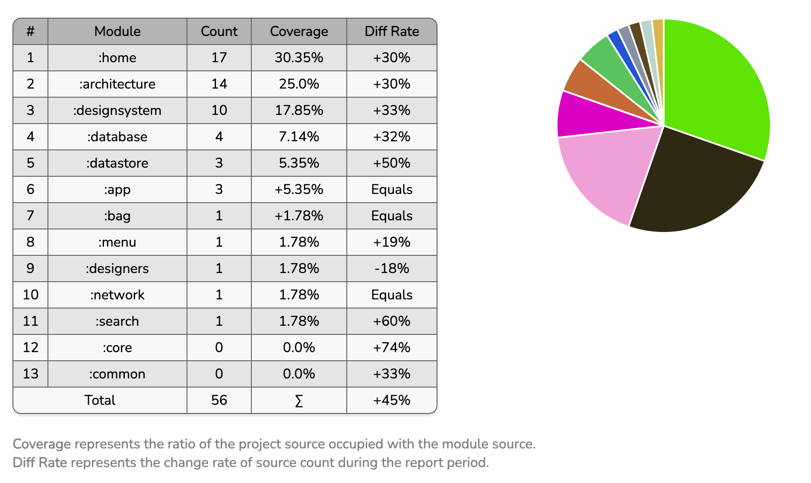
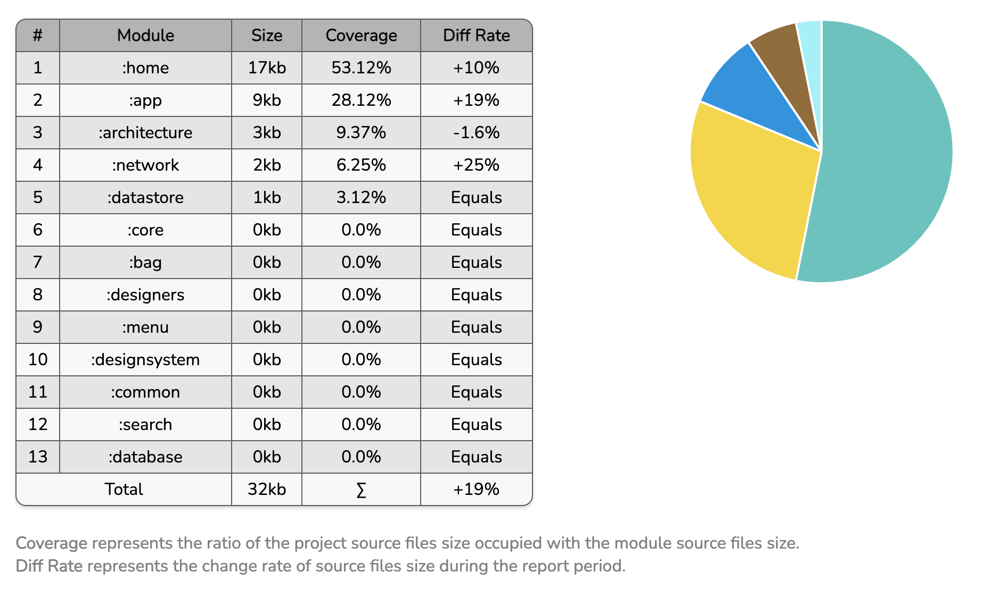
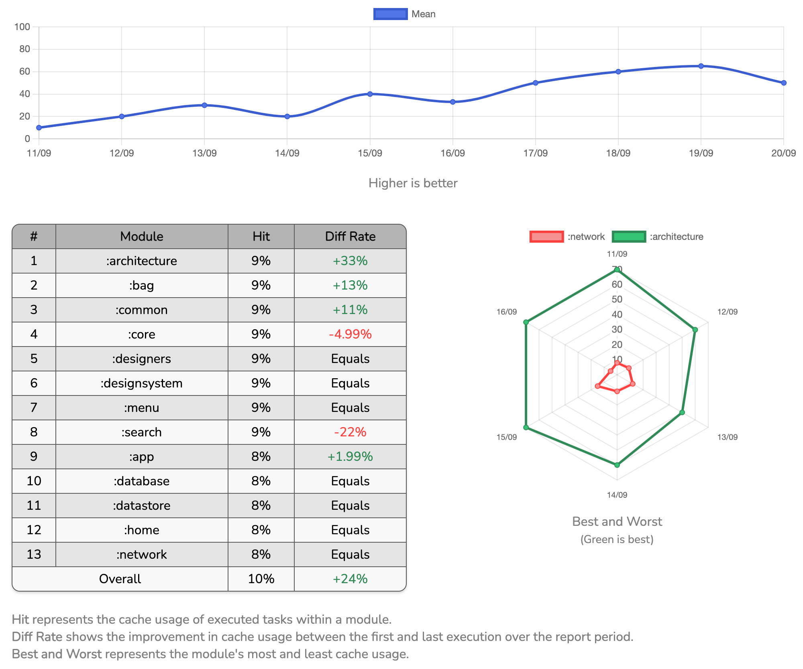
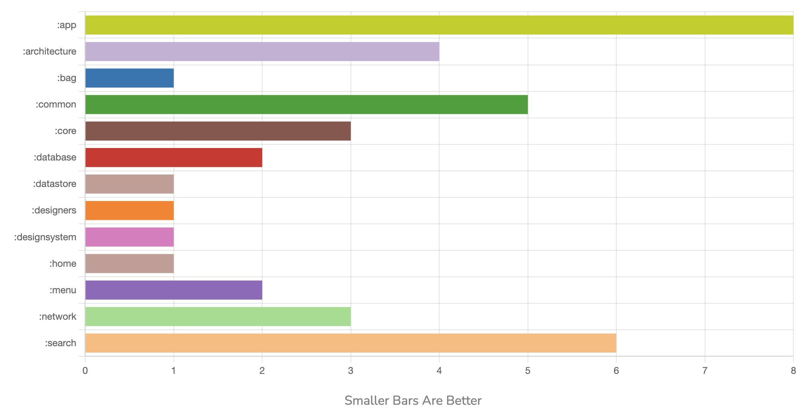
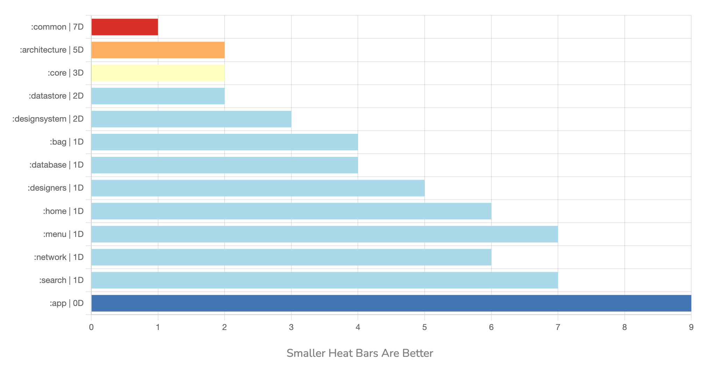

<!--
 MIT License
 Copyright (c) 2024 Mehdi Janbarari (@janbarari)

 Permission is hereby granted, free of charge, to any person obtaining a copy
 of this software and associated documentation files (the "Software"), to deal
 in the Software without restriction, including without limitation the rights
 to use, copy, modify, merge, publish, distribute, sublicense, and/or sell
 copies of the Software, and to permit persons to whom the Software is
 furnished to do so, subject to the following conditions:

 The above copyright notice and this permission notice shall be included in all
 copies or substantial portions of the Software.

 THE SOFTWARE IS PROVIDED "AS IS", WITHOUT WARRANTY OF ANY KIND, EXPRESS OR
 IMPLIED, INCLUDING BUT NOT LIMITED TO THE WARRANTIES OF MERCHANTABILITY,
 FITNESS FOR A PARTICULAR PURPOSE AND NONINFRINGEMENT. IN NO EVENT SHALL THE
 AUTHORS OR COPYRIGHT HOLDERS BE LIABLE FOR ANY CLAIM, DAMAGES OR OTHER
 LIABILITY, WHETHER IN AN ACTION OF CONTRACT, TORT OR OTHERWISE, ARISING FROM,
 OUT OF OR IN CONNECTION WITH THE SOFTWARE OR THE USE OR OTHER DEALINGS IN THE
 SOFTWARE.
-->

# Gradle Analytics Plugin

Have you encountered a lengthy build time despite using the best practices? Are you curious how top tech companies manage their massive project build times?

The build is an important process. If we want to have a faster and more efficient build, we need to understand how it works for our project.

!!! Quote "If you can't measure it, you can't improve it. (Lord Kelvin)"

The Gradle Analytics Plugin helps you analyze and measure your project builds. It provides unique visual and text metrics in HTML format.

To understand the metrics and report that plugin provides, It is required to understand Gradle basics and how this build
system works. <a href="https://docs.gradle.org/current/userguide/userguide.html" target="_blank">https://docs.gradle.org/current/userguide/userguide.html</a>

!!! warning "Important"

    <strong>Support the project by <a href="https://janbarari.github.io/gradle-analytics-plugin/donation/" target="_blank">donation</a>, The first stage of donation expectation is $1500 and $0 donated till now.</strong>

Below you can see the metrics provided by the plugin 👇

## Build Status
An overview of metrics results of the `requested task` in the build processes over the aforementioned period.

 
## Initialization Process
Gradle supports single and multi-project builds. During the initialization process, Gradle determines which projects are going to take part in the build, and creates a Project instance for each of these projects.

It denotes the average initialization process time over the report period.

 
## Configuration Process
Constructs and configures the task graph for the build and then determines which tasks need to run and in which order, based on the task the user wants to run.

It shows the average configuration process time over the report period.

 
## Dependency Resolve Process
Downloading the project's dependencies is one of the configuration process stages.

It represents the download/resolve process average duration during the report period.

 
## Execution Process
Runs the selected tasks based on `requested tasks` task tree. Gradle executes `requested task` according to the dependency order.

It represents the Execution Process average duration during the report period.

 
## Modules Execution Process
It represents the median execution process time of each module over the report period.

 
## Overall Build Process
It represents the average duration of overall build process.

 
## Modules Source Count
It represents the project and its modules source file count. (files with extension of `kt`, `java`).

 
## Modules Source Size
It represents the project and its modules source file size.

 
## Modules Method Count
It represents the project and its modules source method count.

 
## Cache Hit
Gradle creates a cache for the executed task to be reused in the next incremental builds, the more cached tasks lead to faster builds.

It represents the project and modules tasks average cache hit rate (tasks run with `FROM_CACHE` or `UP_TO_DATE`).

 
## Successful Build Rate
It represents the successful build rate of the `requested task` during the report period.

 
## Modules Crash Count
It represents how many build failures happened to the `requested task` execution caused by project modules during the report period.

 
## Parallel Execution Rate
Gradle uses CPU cores to execute more tasks simultaneously, leading to a faster build.

It represents a rate of how much time was saved in the execution of the build process with parallel execution versus serial elapsed time.

 
## Modules Dependency Graph
It represents the project module's dependency graph and with it connection types.

Modules in the graph are clickable (shows first/deep nodes).
Modules with warm colors are more dependent modules, and it is recommended to have fewer warm color modules because, by applying any change to these modules, all other dependent modules need to rebuild, which takes more time and resources.

 
## Redundant Dependency Connection
it represents the project modules redundant dependency connection.

 
## Modules Execution Timeline
It represents the latest modules execution process timeline graph.

 
## Modules Build Heatmap
Shows how many times a module was built during the report period.

Each bar has the name of the module and the number of dependent modules, smaller warm bars lead to faster builds as those modules with warm colors have more dependent modules.

In addition, it helps to modify the modular structure by tracing the graph and finding the cause to avoid rebuilding the modules that are most shared with others.

 
## Non-cacheable Tasks
These tasks are executed in the `requested task` tree without being cached. Try to avoid creating tasks that are not cacheable.

   